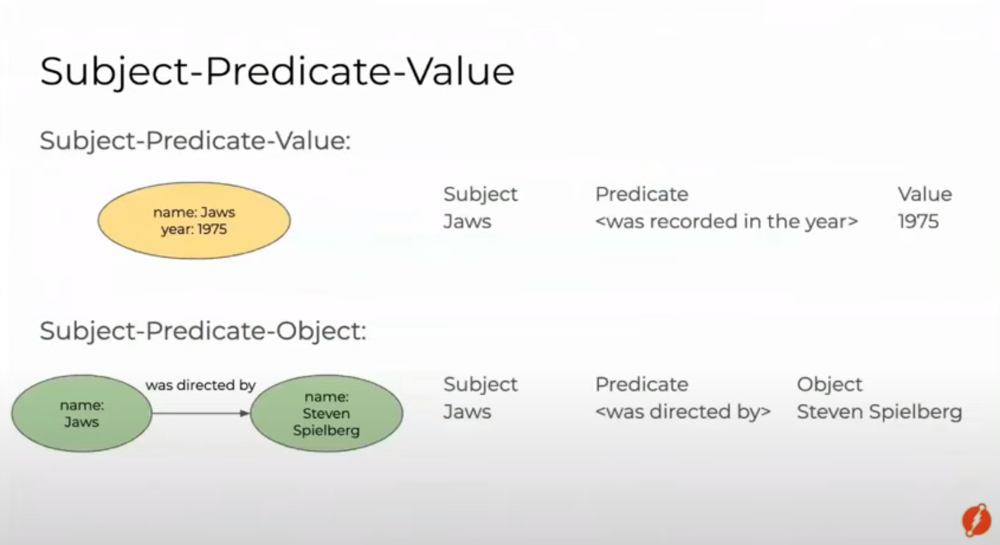
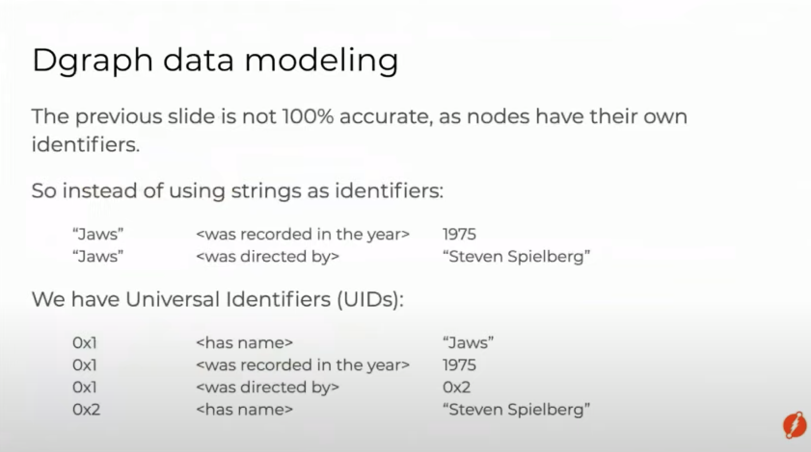
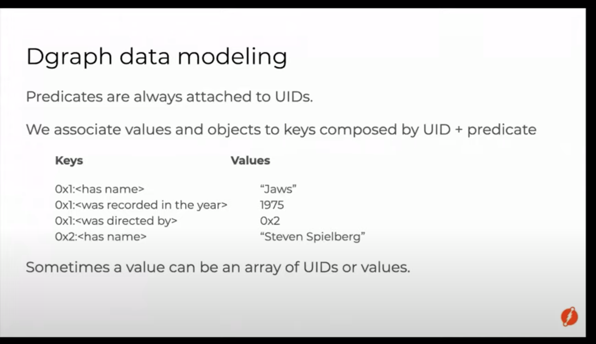

# Reference 
https://www.youtube.com/watch?v=CjkKRbtwWXA

https://www.youtube.com/watch?v=cHXbYLNa0qQ

https://dgraph.io/tour/

# Introduction
Following are features of DGraph
- Open source
- Transactional
- Distributed
- Native Graph Database
## Installation for local development
```
docker run --rm -it -p 8000:8000 -p 8080:8080 -p 9080:9080 dgraph/standalone:latest
```
Following are URLs for local development
```
Ratel UI:  http://localhost:8000/
DGraph HTTP: http://localhost:8080/
```
## Nodes and Edges
- In a Graph Database, concepts or entities are represented as nodes. 
- May it be a sale, a transaction, a place, or a person, all these entities are represented as nodes in a Graph Database.
- An edge represents the relationship between two nodes. 
- The two nodes in the above graph represent people: Karthic and Jessica. 
- You can also see that these nodes have two associated properties: name and age.
- These properties of the nodes are called predicates in Dgraph.
- Karthic follows Jessica. The follows edge between them represents their relationship. 
- The edge connecting two nodes is also called a predicate in Dgraph, although this one points to another node rather than a string or an integer.





## Dgraph playground
https://play.dgraph.io/
## UUID
Following operations can be performed using UUID
- Querying, update and deleting predicates using uuid
- Adding edge between existing nodes
- Adding new predicate to existing nodes
- Traversing Graph

## Basic Types and Operations on them
- Basic Data types
- Querying for predicate values
- Indexing
- Filtering nodes
- Traversing in reverse direction
## Sample payload to create nodes and relationships
```
{
  "set": [
    {
      "user_handle": "hackintoshrao",
      "user_name": "Karthic Rao",
      "uid": "_:hackintoshrao",
      "authored": [
        {
          "tweet": "Test tweet for the fifth episode of getting started series with @dgraphlabs. Wait for the video of the fourth one by @francesc the coming Wednesday!\n#GraphDB #GraphQL",
          "tagged_with": [
            {
              "uid": "_:graphql",
              "hashtag": "GraphQL"
            },
            {
              "uid": "_:graphdb",
              "hashtag": "GraphDB"
            }
          ],
          "mentioned": [
            {
              "uid": "_:francesc"
            },
            {
              "uid": "_:dgraphlabs"
            }
          ]
        }
      ]
    },
    {
      "user_handle": "francesc",
      "user_name": "Francesc Campoy",
      "uid": "_:francesc",
      "authored": [
        {
          "tweet": "So many good talks at #graphqlconf, next year I'll make sure to be *at least* in the audience!\nAlso huge thanks to the live tweeting by @dgraphlabs for alleviating the FOMO😊\n#GraphDB ♥️ #GraphQL",
          "tagged_with": [
            {
              "uid": "_:graphql"
            },
            {
              "uid": "_:graphdb"
            },
            {
              "hashtag": "graphqlconf"
            }
          ],
          "mentioned": [
            {
              "uid": "_:dgraphlabs"
            }
          ]
        }
      ]
    },
    {
      "user_handle": "dgraphlabs",
      "user_name": "Dgraph Labs",
      "uid": "_:dgraphlabs",
      "authored": [
        {
          "tweet": "Let's Go and catch @francesc at @Gopherpalooza today, as he scans into Go source code by building its Graph in Dgraph!\nBe there, as he Goes through analyzing Go source code, using a Go program, that stores data in the GraphDB built in Go!\n#golang #GraphDB #Databases #Dgraph ",
          "tagged_with": [
            {
              "hashtag": "golang"
            },
            {
              "uid": "_:graphdb"
            },
            {
              "hashtag": "Databases"
            },
            {
              "hashtag": "Dgraph"
            }
          ],
          "mentioned": [
            {
              "uid": "_:francesc"
            },
            {
              "uid": "_:dgraphlabs"
            }
          ]
        },
        {
          "uid": "_:gopherpalooza",
          "user_handle": "gopherpalooza",
          "user_name": "Gopherpalooza"
        }
      ]
    }
  ]
}
```
## Sample queries
```

```
# Javascript Clients
https://github.com/dgraph-io/dgraph-js
## Creating a client
```
const dgraph = require("dgraph-js");
const grpc = require("grpc");
const clientStub = new dgraph.DgraphClientStub(
  "localhost:9080",
  grpc.credentials.createInsecure(),
);
const dgraphClient = new dgraph.DgraphClient(clientStub);
```
## Altering Database
```
const schema = "name: string @index(exact) .";
const op = new dgraph.Operation();
op.setSchema(schema);
await dgraphClient.alter(op);
```
## Transactions
```
const txn = new dgraphClient.newTxn();
try {
  // Do something here
  // ...
} finally {
  await txn.discard();
  // ...
}
```
## Running a mutations
```
// Create data.
const p = {
    name: "Alice",
};
// Run mutation.
const mu = new dgraph.Mutation();
mu.setSetJson(p);
await txn.mutate(mu);

```
## Running a query
```
// Run query.
const query = `query all($a: string) {
  all(func: eq(name, $a))
  {
    name
  }
}`;
const vars = { $a: "Alice" };
const res = await dgraphClient.newTxn().queryWithVars(query, vars);
const ppl = res.getJson();
// Print results.
console.log(`Number of people named "Alice": ${ppl.all.length}`);
ppl.all.forEach((person) => console.log(person.name));
```
## Running an Upsert: Query + Mutation
- The txn.doRequest function allows you to run upserts consisting of one query and one mutation.
```
const query = `
  query {
      user as var(func: eq(email, "wrong_email@dgraph.io"))
  }`
  const mu = new dgraph.Mutation();
mu.setSetNquads(`uid(user) <email> "correct_email@dgraph.io" .`);
const req = new dgraph.Request();
req.setQuery(query);
req.setMutationsList([mu]);
req.setCommitNow(true);
// Upsert: If wrong_email found, update the existing data
// or else perform a new mutation.
await dgraphClient.newTxn().doRequest(req);
```
## Running a Conditional Upsert

```
const query = `
  query {
      user as var(func: eq(email, "wrong_email@dgraph.io"))
  }`
  const mu = new dgraph.Mutation();
mu.setSetNquads(`uid(user) <email> "correct_email@dgraph.io" .`);
mu.setCond(`@if(eq(len(user), 1))`);

const req = new dgraph.Request();
req.setQuery(query);
req.addMutations(mu);
req.setCommitNow(true);

await dgraphClient.newTxn().doRequest(req);

```
## Cleanup Resources
```
// Cleanup resources by closing all client stubs.
stub1.close();
```
# Implementations
- gRPC Internally this is using Protocol Buffers 
- HTTP


